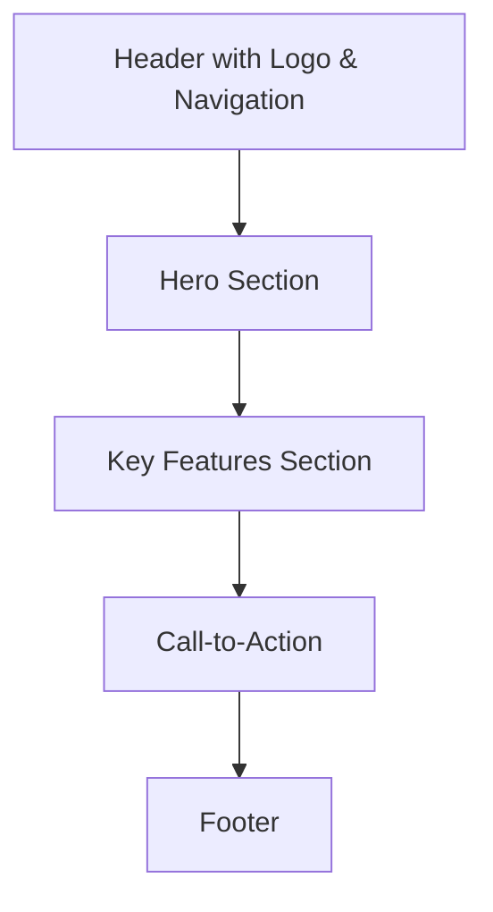
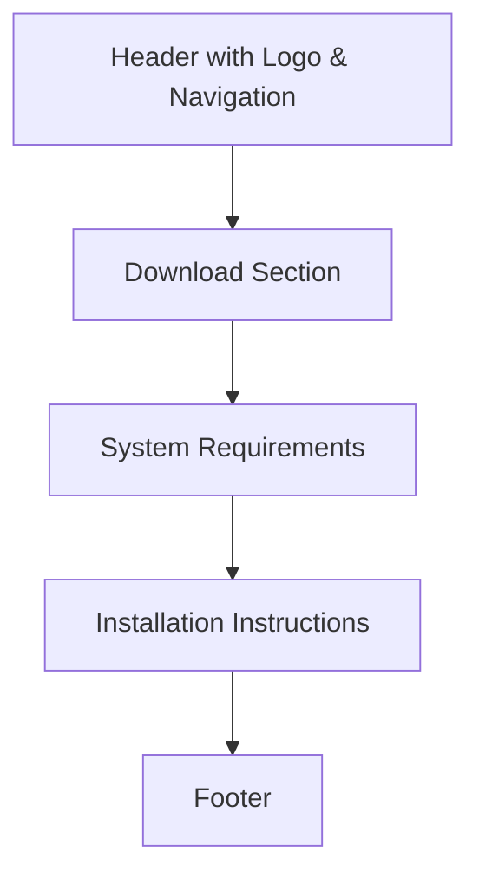

# Truncate Website Architecture Plan

## Overview

This document outlines the architecture plan for the GitHub Pages website for "Truncate the AI Legal Work Environment". The website will consist of a landing page and a download page, with a dark theme and teal accent colors.

## 1. File Organization

```
website/
├── index.html                # Landing/Welcome Page
├── download.html             # Download Page
├── assets/
│   ├── css/
│   │   └── styles.css        # Main stylesheet
│   ├── js/
│   │   └── main.js           # Minimal JavaScript
│   └── images/
│       ├── logo.svg          # Truncate logo
│       └── screenshots/      # Application screenshots
└── _config.yml               # GitHub Pages configuration
```

## 2. Page Layouts

### 2.1. Landing Page (index.html)



#### Header

- Logo
- Simple navigation to Download page

#### Hero Section

- Headline: "Truncate: AI Legal Work Environment"
- Brief description: "A customized VS Code environment for legal professionals"
- Hero image: Screenshot of Truncate interface
- CTA button: "Download Now" (links to download page)

#### Key Features Section

- Four feature cards highlighting:
  1. AI-powered document analysis
  2. Contract review automation
  3. Legal research assistance
  4. Secure environment for confidential documents

#### Call-to-Action

- "Get Started Today" with download buttons for macOS and Windows

#### Footer

- Copyright information
- Minimal links

### 2.2. Download Page (download.html)



#### Download Section

- Clear headline: "Download Truncate"
- Download buttons for:
  - macOS (ARM64/Intel)
  - Windows (x64)
- Version number and release date

#### System Requirements

- Minimal requirements for macOS and Windows

#### Installation Instructions

- Basic steps for installation on each platform

## 3. Design Specifications

### 3.1. Color Palette

- **Primary Background**: Dark (#121212)
- **Secondary Background**: Slightly lighter dark (#1E1E1E)
- **Primary Text**: White (#FFFFFF)
- **Secondary Text**: Light gray (#CCCCCC)
- **Accent Color**: Teal (#00B3A4)
- **Button Hover**: Lighter teal (#00D6C4)

### 3.2. Typography

- **Headings**: Sans-serif font (e.g., Inter, Roboto)
- **Body Text**: Sans-serif font for readability on dark backgrounds
- **Font Sizes**:
  - Large headings: 2.5rem
  - Section headings: 1.8rem
  - Body text: 1rem

### 3.3. Layout

- Clean, minimal design
- Ample white space
- Maximum content width of 1200px
- Responsive design with breakpoints for mobile, tablet, and desktop

## 4. Content Requirements

### 4.1. Landing Page Content

#### Hero Section

- Headline: "Truncate: AI Legal Work Environment"
- Subheadline: "A customized VS Code environment with AI tools for legal professionals"
- Brief description (2-3 sentences) explaining what Truncate does
- Screenshot showing the application interface

#### Key Features Content

For each feature:

- Icon or small illustration
- Feature name
- Brief description (1-2 sentences)

Features to highlight:

1. **AI-powered document analysis**: "Automatically extract key information from legal documents"
2. **Contract review automation**: "Identify risks, obligations, and important clauses"
3. **Legal research assistance**: "Find relevant cases and statutes with AI assistance"
4. **Secure environment**: "Handle confidential documents with privacy controls"

### 4.2. Download Page Content

#### Download Section

- Clear instructions for downloading
- Download buttons for macOS and Windows
- Version information and release date

#### System Requirements

- macOS: Version requirements, processor, RAM
- Windows: Version requirements, processor, RAM

#### Installation Instructions

- 3-4 simple steps for installation on each platform

## 5. Technical Implementation

### 5.1. GitHub Pages Setup

- Use basic GitHub Pages with minimal Jekyll configuration
- Configure \_config.yml for proper site settings

### 5.2. GitHub Actions Workflow

- Simple workflow for deploying the website to GitHub Pages

## 6. Next Steps

1. Create HTML templates for the landing page and download page
2. Implement CSS styling with the dark theme and teal accents
3. Add minimal JavaScript functionality
4. Set up GitHub Pages and GitHub Actions workflow
5. Test the website on different devices and browsers
